# 遥感图像智能解译

<center><font size=5>Intelligent Interpretation of Remote Sensing Images</font></center>

遥感图像智能解译系统（I2RSI System）由武汉大学遥感信息工程学院I2RSI团队开发，是一款基于百度飞浆PaddlePaddle深度学习框架的Web端遥感影像解译应用。

[TOC]

## 应用部署

1. 克隆到本地

   `git clone https://github.com/TwSphinx54/I2RSI.git`

2. [下载](##权重下载)并将用模型权重数据替换`.\weights`文件夹

3. 确保计算机上拥有Anaconda虚拟环境，运行`@deploy.bat`自动部署运行环境

4. **全自动运行**

   1. 部署完成后运行`@run.bat`，等待一段时间后刷新网页

   2. 欲使用桌面版应用，运行`@desktop.bat`

5. **手动运行**：

   1. ```bash
      conda activate I2RSI
      python .\process.py
      ```

      服务启动后，通过浏览器访问`http://127.0.0.1:8080/welcome`即可开始使用应用

   2. ```bash
      conda activate I2RSI
      python .\webstart.py
      ```

      桌面端启动


## 应用卸载

```bash
rmdir /s /q .\I2RSI
conda remove -n I2RSI --all --y
```

## 使用教程

**I2RSI系统**包含了四大基础功能以及四大创新特色功能：

> 基础功能：
>
> | 目标提取 | 变化检测 | 目标检测 | 地物分类 |
> | :------: | :------: | :------: | :------: |
>
> 创新特色：
>
> | 道路提取半自动补全 | 在线卫星影像选择 | 遥感影像批处理 | 自定义模型管理 |
> | :----------------: | :--------------: | :------------: | :------------: |

本项目提供了测试demo数据集，请使用`unzip ./data_demo.zip`获取测试数据

1. 进入网站首页`http://127.0.0.1:8080/welcome`可以看到欢迎页面，点击圆形按钮进入选择功能页面；

   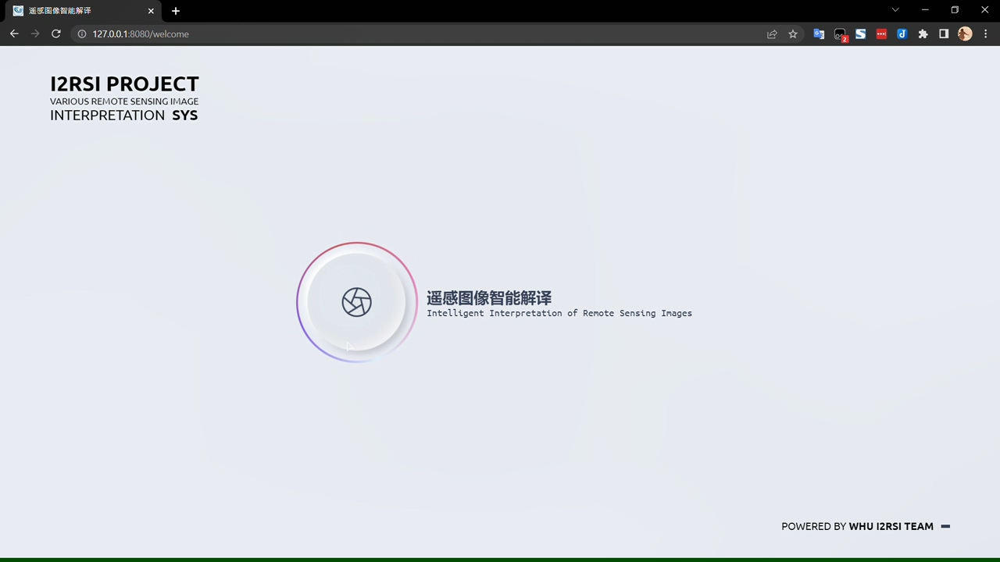

2. 在此处可以选择对应功能进行遥感影像解译，并可在右侧面板上进行参数的调整；

   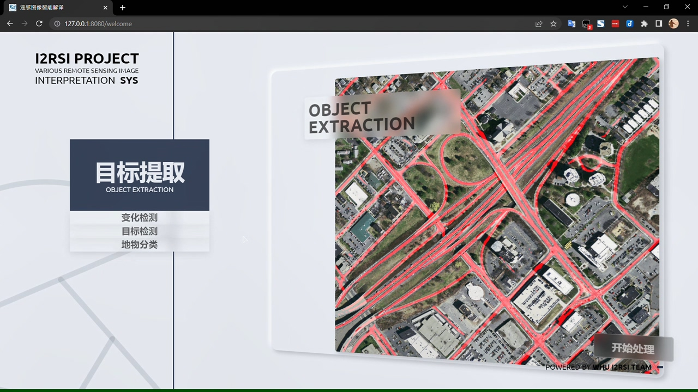

3. 点击开始处理，则加载模型；

   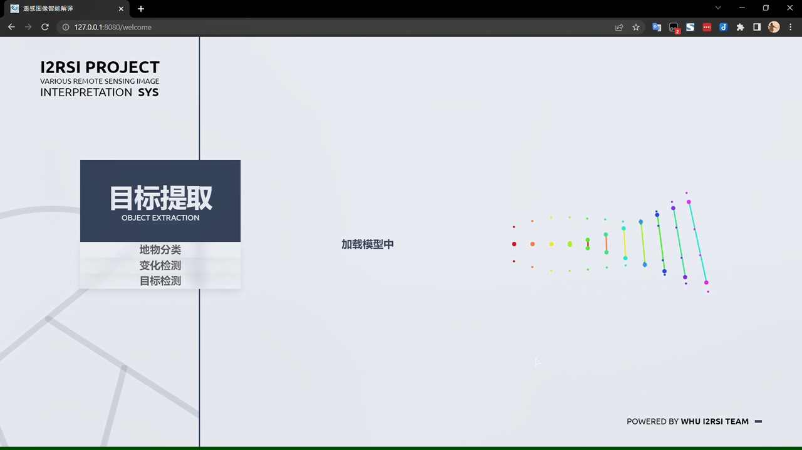

4. 加载完成后进入上传图片页面，除变化检测需要上传双时相遥感影像以外，其余功能均为上传一张影像即可；

   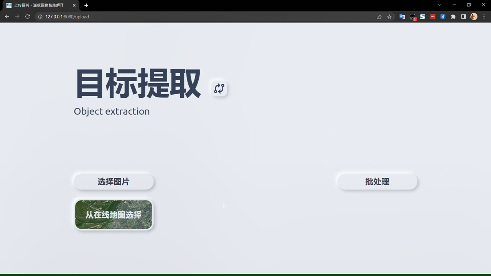

5. 解译结果页面可以下载解译报告以及解译结果图，此外还能与可视化的解译结果进行交互：
   * **目标提取**：鼠标在右侧结果图上框选可以在左侧查看对应区域的放大图像，区域内的标签也展示了框选区域的各项参数；
   
     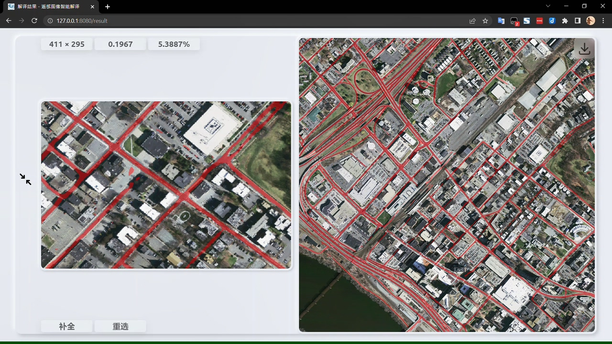
   
   * **变化检测**：鼠标在右侧结果图上框选可以在左侧查看对应区域内两张双时相图像的细节放大图像，便于进一步比较建筑物变化并评估变化检测效果；
   
     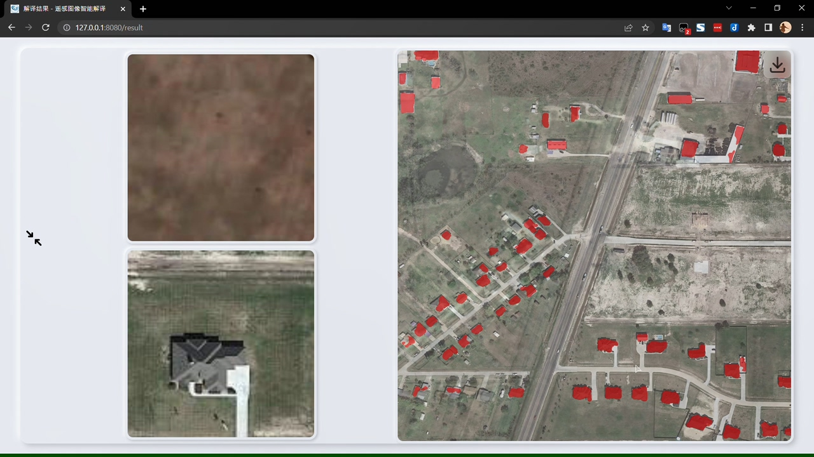
   
   * **目标检测**：鼠标移动到右侧结果图中对应目标上并点击，可以在左侧看到该目标的放大图像，并显示该目标在目标检测中的详细得分；
   
     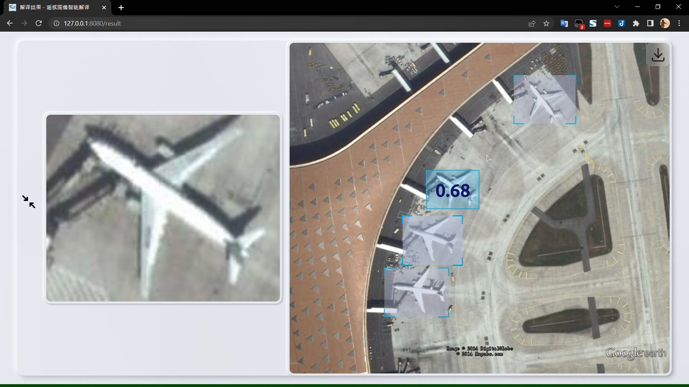
   
   * **地物分类**：鼠标移动左侧单个类别地物的分布图上并点击，可以在右侧叠置图中看到该类型地物的高亮显示，并在点击的分布图上显示该类别统计信息。
   
     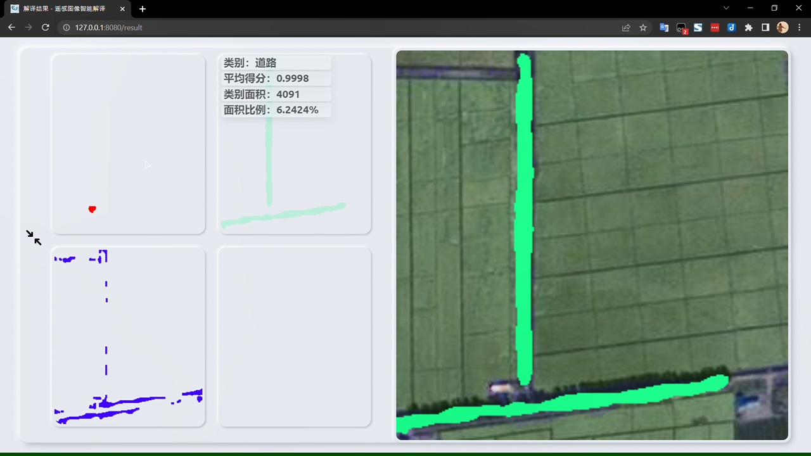
   
6. 此外还有四大创新功能欢迎体验：
   * **道路提取半自动补全**：在目标提取的详细展示界面，点击开始补全，可以对框选区域内提取的道路目标进行半自动补全，在左侧放大图中可以看到补全后的效果图，点击确定按钮则可以应用当前的补全；
   
     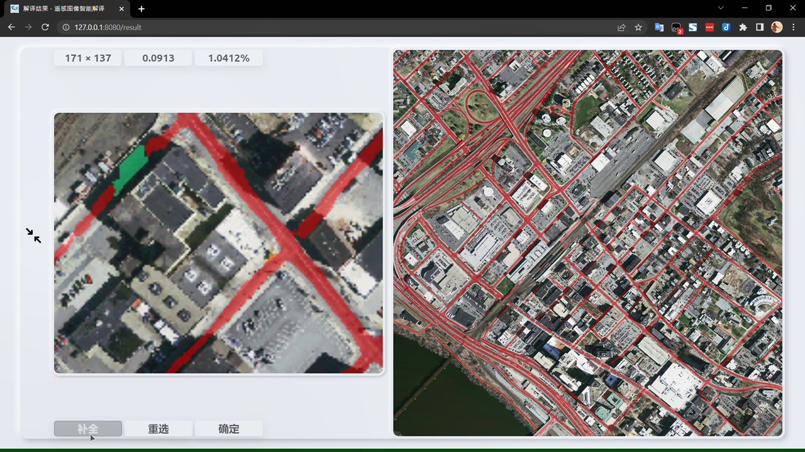
   
   * **在线卫星影像选择**：在上传图片时，可以点击从在线卫星影像选取，进入在线卫星影像选取界面，鼠标缩放，点击拖动至任意感兴趣地区，也可在右上角搜索地名，然后点击开始选择，则进入框选模式，左上角信息展示窗口会实时显示出选择图片的信息。点击开始上传则可以进行后续遥感影像解译工作；
   
     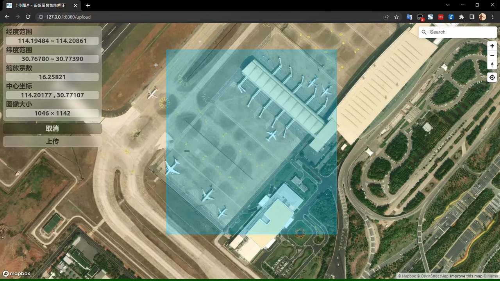
   
   * **遥感影像批处理**：在上传图片时，可以点击批处理按钮，进入批处理模式，选择多张影像，选择后可以预览并删除不需要的影像，然后点击处理按钮开始对选择的图像进行批量解译。解译完成后进去解译结果界面，鼠标悬浮可以查看单张影像的解译结果参数，点击可以对该结果进行交互，交互效果与单张影像解译时相同。
   
     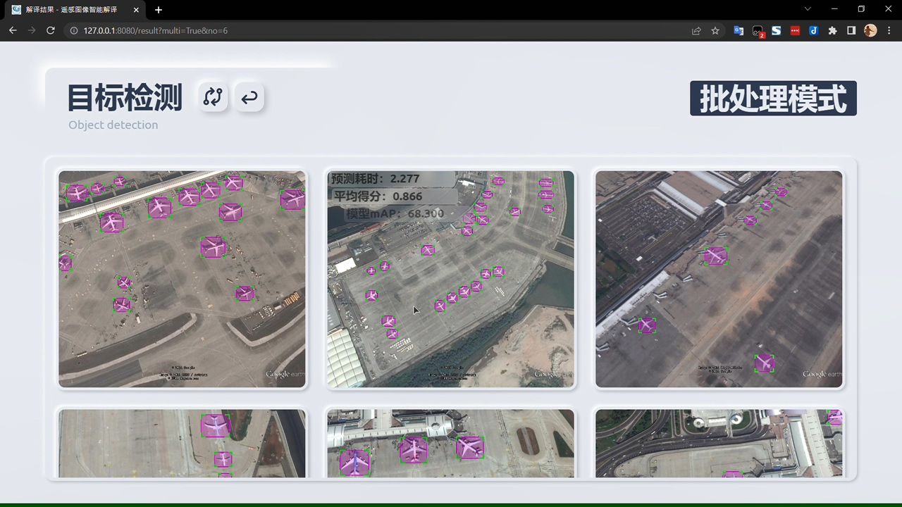
     
   * **自定义模型管理**：在模型选择界面，可以看到右方的模型管理面板，选中模型可以查看其相应的模型描述，选中想要的模型，点击开始处理可以使用该模型进行图像解译。
   
     
   
     点击添加模型按钮，弹出上传模型窗口，通过该窗口可以自定义上传模型的名称及其描述，系统会自动判断上传文件内容是否可用，且考虑到了XSS攻击的应对。
   
     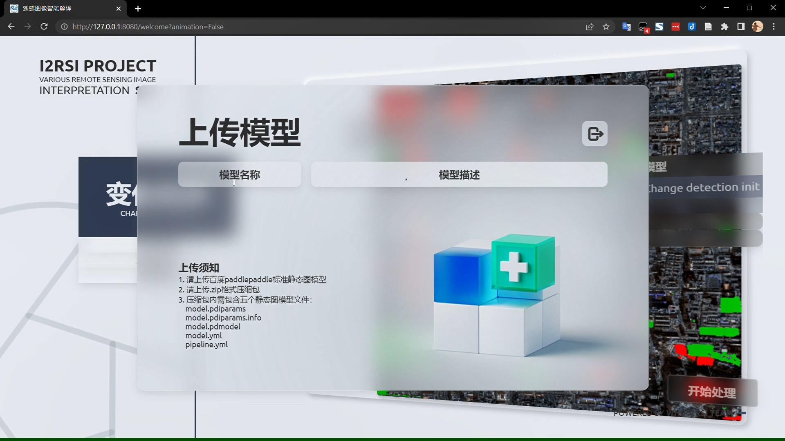
   
     点击删除模型按钮，会弹出确认窗口，二次确认是否删除当前选中的模型。
   
     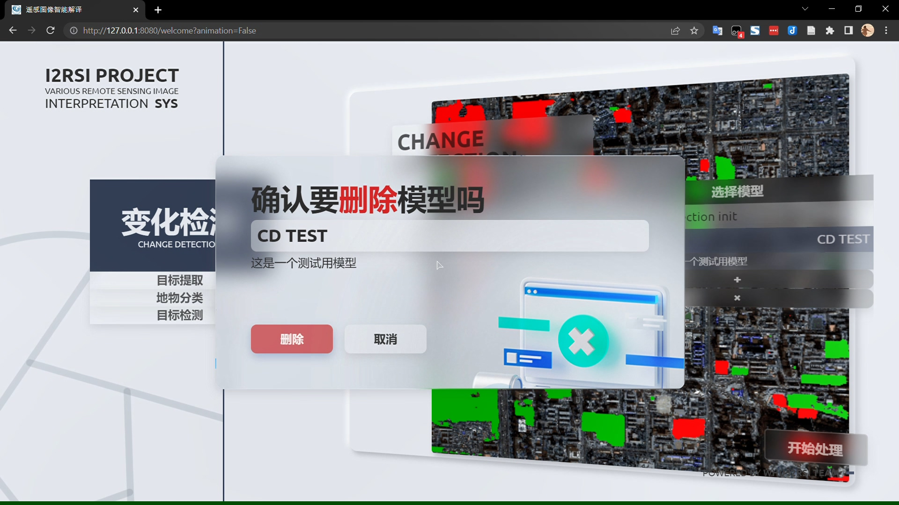

## 权重下载

[百度网盘](https://pan.baidu.com/s/1ZocI8F_ILV7O_-WoajZ_7Q) 提取码：`IRSI`

如果链接失效请联系邮箱：`panxurs@whu.edu.cn`

## 说明

本项目使用的模型均基于[百度PaddlePaddle深度学习框架](https://www.paddlepaddle.org.cn/)，使用百度深度学习平台[AI Studio](https://aistudio.baidu.com/aistudio/index)进行训练。

本项目使用的变化检测模型详细训练方案获得百度AI Studio**精品**项目认证，请见[【十一届软件杯】双时相遥感图像建筑物变化检测](https://aistudio.baidu.com/aistudio/projectdetail/4296935)

本项目是第十一届“中国软件杯”大学生软件设计大赛比赛成果，比赛详情请见[比赛官网](http://cnsoftbei.com/)

## 开源项目鸣谢

[古代飞](https://aistudio.baidu.com/aistudio/personalcenter/thirdview/1047644)：[【官方】第十一届 “中国软件杯”百度遥感赛项：目标提取功能](https://aistudio.baidu.com/aistudio/projectdetail/3792610)   
[lzzzzzm](https://aistudio.baidu.com/aistudio/personalcenter/thirdview/653110)：[【十一届软件杯】遥感解译赛道：变化检测任务——预赛第四名方案分享](https://aistudio.baidu.com/aistudio/projectdetail/4283153)   
[trainer](https://aistudio.baidu.com/aistudio/personalcenter/thirdview/58424)：[【方案分享】第十一届 “中国软件杯”大学生软件设计大赛遥感解译赛道 比赛方案分享](https://aistudio.baidu.com/aistudio/projectdetail/4146154)   
[lawliet7](https://aistudio.baidu.com/aistudio/personalcenter/thirdview/2193157)：[【十一届软件杯】变换检测方案分享](https://aistudio.baidu.com/aistudio/projectdetail/4128982)   
[白金之星Henry](https://aistudio.baidu.com/aistudio/personalcenter/thirdview/721533)：[第十一届中国软件杯遥感变化检测预选赛16名解决方案](https://aistudio.baidu.com/aistudio/projectdetail/4124345)   
[你好，我是帅哥](https://aistudio.baidu.com/aistudio/personalcenter/thirdview/510194)：[【软件杯】变化检测，面向小白只调参上85](https://aistudio.baidu.com/aistudio/projectdetail/4117697)   
[wcfun](https://aistudio.baidu.com/aistudio/personalcenter/thirdview/2188691)：[【方案分享】第十一届“中国软件杯”百度遥感赛项：变化检测功能](https://aistudio.baidu.com/aistudio/projectdetail/3809358)   
[PaddleCV-SIG/PaddleRS](https://github.com/PaddleCV-SIG/PaddleRS)   
[PaddlePaddle/PaddleSeg](https://github.com/PaddlePaddle/PaddleSeg)   
[justchenhao/BIT_CD](https://github.com/justchenhao/BIT_CD)  

## Update log  

* [2022.6.28] **Beta 1.0 released**: Every basic function has been established.
* [2022.6.28] **Beta 2.0 released**: All functional component completed. Now the focus of work shifts to better algorithm performance.
## TODO
* Slider prediction of Object Classification

